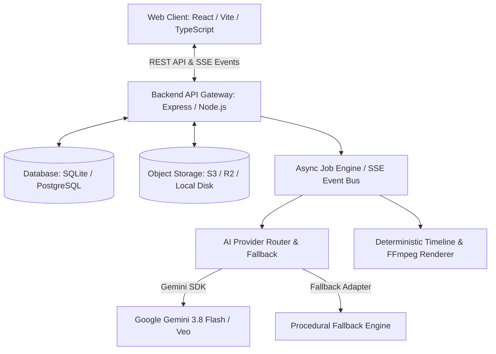
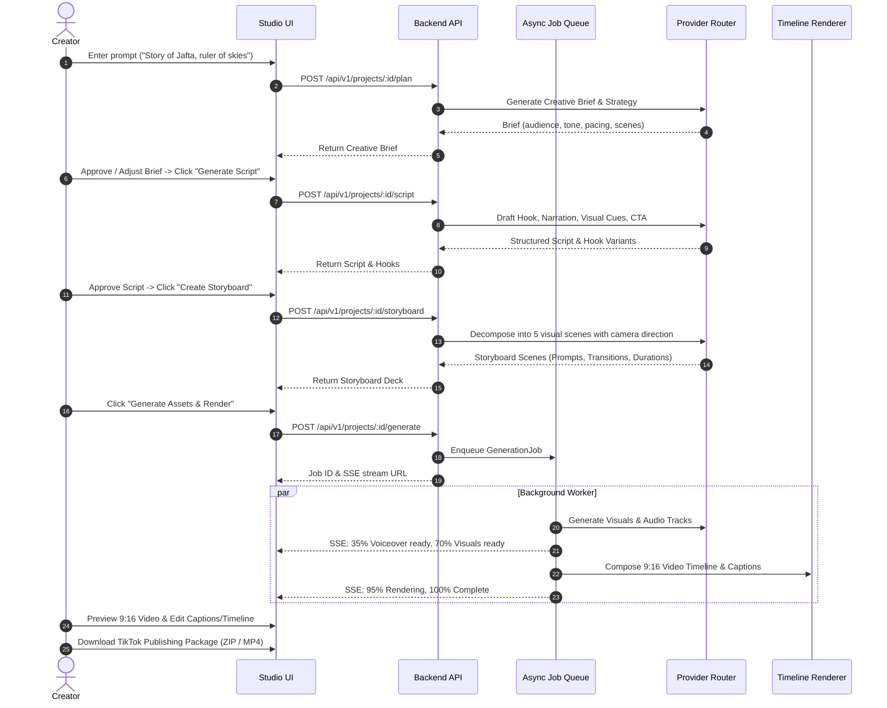

# JayTech AI — System Architecture Specification

## 1. System Overview

JayTech AI is a production-grade, full-stack video creation platform designed to transform raw ideas, scripts, and brand assets into polished short-form videos (specifically optimized for TikTok, YouTube Shorts, and Instagram Reels).

## 2. Component Boundaries

### A. Frontend Layer (`src/`)
- Built with React 19, TypeScript, Tailwind CSS, Lucide Icons, and Motion.
- Pure client-side UI rendering with strict Zero-Pill design system and dark-mode-first aesthetic.
- In-browser Canvas + Web Audio deterministic preview engine supporting 9:16 (1080x1920) aspect ratio, Ken Burns camera pan/zoom, dynamic karaoke captions, and immediate audio mixing.
- Consumes REST API endpoints and listens to Server-Sent Events (SSE) for asynchronous job progress.

### B. Core Backend API (`server/`)
- Express 4 + TypeScript server running unified on port 3000 in development via Vite middleware.
- Full RESTful API versioning (`/api/v1/*`).
- Handles authentication, role-based authorization (USER, CREATOR, ADMIN), project lifecycle, scenes, templates, brand kits, content series, calendar scheduling, and media metadata.
- Never exposes internal API keys or provider secrets to the browser.

### C. AI Provider Layer (`server/providers/`)
- Abstract provider interfaces: `LLMProvider`, `ImageGenerationProvider`, `VideoGenerationProvider`, `SpeechProvider`, `MusicProvider`.
- Production implementation using the `@google/genai` TypeScript SDK (model `gemini-3.8-flash` for content planning, scriptwriting, hook generation, scene decomposition, and visual prompts).
- Integrated `MockFallbackProvider` ensuring full offline operability, deterministic automated testing, and graceful degradation during network disruption.
- Provider router with automatic retry, latency metrics, and usage ledger accounting.

### D. Asynchronous Job & Worker Engine (`server/jobs/`)
- Non-blocking job runner managing long-running tasks:
  1. Content planning & script generation
  2. Scene storyboard decomposition
  3. Visual asset generation
  4. Voiceover & audio synthesis
  5. Captions & timeline composition
  6. Final video rendering and packaging
- Publishes real-time progress updates (0% to 100%) streamed via Server-Sent Events (`/api/v1/jobs/:id/events`).

### E. Rendering Engine (`server/renderer/`)
- Deterministic media composition:
  - Generates exact FFmpeg CLI command recipes and timeline tracks.
  - Generates standard SubRip (`.srt`) subtitle tracks with word-level timestamps.
  - Bundles standard TikTok Publishing Packages containing `video.mp4`, `cover.jpg`, `caption.txt`, `hashtags.txt`, `script.txt`, `subtitles.srt`, and `metadata.json`.

---

## 3. Data Flow: From Idea to Export

